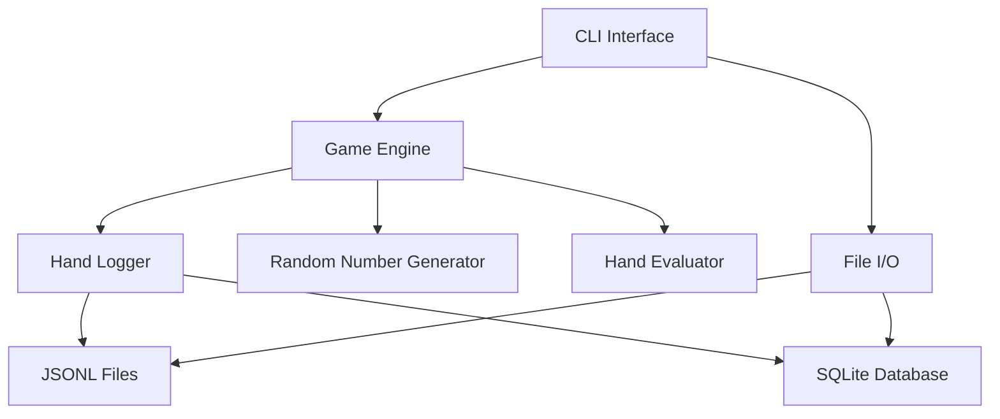

# Design Document

## Overview

The Axiomind Heads-Up No-Limit Hold'em system is designed as a modular Rust-based poker engine with a comprehensive CLI interface. The architecture separates concerns between game logic (engine), user interface (CLI), and data persistence (JSONL + SQLite), enabling reliable poker simulations and analysis for research purposes.

## Architecture

### High-Level Architecture



### Module Structure

```
rust/
├── engine/           # Core game logic
│   ├── src/
│   │   ├── game.rs      # Game state and flow control
│   │   ├── rules.rs     # Texas Hold'em rules implementation
│   │   ├── hand.rs      # Hand evaluation and comparison
│   │   ├── deck.rs      # Card deck and shuffling
│   │   ├── player.rs    # Player state and actions
│   │   ├── pot.rs       # Pot management and side pots
│   │   ├── logger.rs    # Hand history logging
│   │   └── lib.rs       # Public API exports
│   └── Cargo.toml
├── cli/              # Command-line interface
│   ├── src/
│   │   ├── commands/    # Individual CLI commands
│   │   ├── config.rs    # Configuration management
│   │   ├── ui.rs        # Terminal UI helpers
│   │   └── main.rs      # CLI entry point
│   └── Cargo.toml
└── Cargo.toml        # Workspace configuration
```

## Components and Interfaces

### Game Engine Core

**GameEngine**
- Manages overall game state and flow
- Coordinates between players, deck, and pot
- Enforces betting rules and hand progression
- Triggers logging events

```rust
pub struct GameEngine {
    players: [Player; 2],
    deck: Deck,
    pot: PotManager,
    board: Vec<Card>,
    current_street: Street,
    button_position: usize,
    level: u8,
    hand_count: u32,
    rng: Box<dyn RngCore>,
}

pub trait GameEngine {
    fn new(seed: Option<u64>, level: u8) -> Self;
    fn deal_hand(&mut self) -> Result<(), GameError>;
    fn process_action(&mut self, action: PlayerAction) -> Result<GameState, GameError>;
    fn is_hand_complete(&self) -> bool;
    fn get_winners(&self) -> Vec<Winner>;
}
```

**Hand Evaluator**
- Evaluates 5-card poker hands
- Compares hands for showdown determination
- Optimized for performance in simulations

```rust
pub struct HandEvaluator;

impl HandEvaluator {
    pub fn evaluate_hand(cards: &[Card; 7]) -> HandRank;
    pub fn compare_hands(hand1: &HandRank, hand2: &HandRank) -> Ordering;
    pub fn best_five_cards(cards: &[Card; 7]) -> [Card; 5];
}
```

**Deck Management**
- 52-card deck with proper shuffling
- Card burning according to Texas Hold'em rules
- Deterministic shuffling when seed is provided

```rust
pub struct Deck {
    cards: Vec<Card>,
    position: usize,
    rng: Box<dyn RngCore>,
}

impl Deck {
    pub fn new(rng: Box<dyn RngCore>) -> Self;
    pub fn shuffle(&mut self);
    pub fn deal_card(&mut self) -> Option<Card>;
    pub fn burn_card(&mut self);
    pub fn reset(&mut self);
}
```

### CLI Interface

**Command Structure**
- Each command implemented as separate module
- Shared configuration and utilities
- Consistent error handling and output formatting

```rust
pub trait Command {
    fn execute(&self, args: &ArgMatches) -> Result<(), CliError>;
    fn name(&self) -> &'static str;
    fn about(&self) -> &'static str;
    fn args(&self) -> Vec<Arg>;
}

pub struct PlayCommand;
pub struct SimCommand;
pub struct ReplayCommand;
pub struct StatsCommand;
// ... other commands
```

**Configuration Management**
- Default settings with override capability
- Environment variable support
- Configuration file support (TOML format)

```rust
pub struct Config {
    pub default_seed: Option<u64>,
    pub default_ai_version: String,
    pub adaptive_ai: bool,
    pub data_directory: PathBuf,
    pub log_level: LogLevel,
}
```

### Data Models

**Hand Record**
- Complete representation of a single hand
- Serializable to JSON for JSONL storage
- Includes all necessary data for replay and analysis

```rust
#[derive(Serialize, Deserialize)]
pub struct HandRecord {
    pub hand_id: String,
    pub seed: Option<u64>,
    pub level: u8,
    pub small_blind: u32,
    pub big_blind: u32,
    pub button: PlayerId,
    pub players: Vec<PlayerInfo>,
    pub actions: Vec<ActionRecord>,
    pub board: Vec<Card>,
    pub showdown: Option<Vec<ShowdownInfo>>,
    pub net_result: HashMap<PlayerId, i32>,
    pub end_reason: EndReason,
    pub timestamp: DateTime<Utc>,
}
```

**Player Action**
- Represents all possible player actions
- Validation logic for bet sizing and legality

```rust
#[derive(Debug, Clone, Serialize, Deserialize)]
pub enum PlayerAction {
    Fold,
    Check,
    Call,
    Bet(u32),
    Raise(u32),
    AllIn,
}
```

## Error Handling

**Error Types**
- Comprehensive error handling with specific error types
- User-friendly error messages for CLI
- Detailed error context for debugging

```rust
#[derive(Debug, thiserror::Error)]
pub enum GameError {
    #[error("Invalid action: {0}")]
    InvalidAction(String),
    #[error("Insufficient chips for action")]
    InsufficientChips,
    #[error("Game already completed")]
    GameCompleted,
    #[error("Invalid bet amount: {amount}, minimum: {minimum}")]
    InvalidBetAmount { amount: u32, minimum: u32 },
}

#[derive(Debug, thiserror::Error)]
pub enum CliError {
    #[error("IO error: {0}")]
    Io(#[from] std::io::Error),
    #[error("Game error: {0}")]
    Game(#[from] GameError),
    #[error("Invalid configuration: {0}")]
    Config(String),
}
```

## Testing Strategy

**Unit Testing**
- Comprehensive unit tests for all game logic
- Property-based testing for hand evaluation
- Deterministic tests using fixed seeds

**Integration Testing**
- End-to-end CLI command testing
- Hand history format validation
- Cross-platform compatibility testing

**Performance Testing**
- Benchmarks for hand evaluation speed
- Memory usage profiling for long simulations
- Stress testing with large datasets

**Test Organization**
```
tests/
├── unit/
│   ├── test_hand_evaluation.rs
│   ├── test_game_rules.rs
│   ├── test_pot_management.rs
│   └── test_deck_shuffling.rs
├── integration/
│   ├── test_cli_commands.rs
│   ├── test_hand_logging.rs
│   └── test_replay_accuracy.rs
└── benchmarks/
    ├── bench_hand_evaluation.rs
    └── bench_simulation_speed.rs
```

## Data Flow

### Game Execution Flow
1. CLI parses command and arguments
2. GameEngine initializes with specified parameters
3. For each hand:
   - Deck shuffles and deals cards
   - Players make actions through CLI or AI interface
   - Engine validates actions and updates state
   - Hand completes and winner is determined
   - HandRecord is logged to JSONL file
4. Game ends when termination condition is met
5. Final statistics are displayed

### Data Persistence
- **JSONL Format**: One line per hand, UTF-8 encoded with LF line endings
- **SQLite Aggregation**: Periodic aggregation of JSONL data for fast queries
- **File Organization**: Organized by date and session for easy management

### Replay and Analysis
1. CLI reads JSONL files
2. HandRecord objects are deserialized
3. Game state is reconstructed step by step
4. Analysis functions process the reconstructed data
5. Results are output in requested format

## Performance Considerations

**Memory Management**
- Efficient card representation using bit manipulation
- Minimal allocations during gameplay
- Streaming processing for large datasets

**CPU Optimization**
- Fast hand evaluation using lookup tables
- Optimized shuffling algorithms
- Parallel processing for simulations where applicable

**I/O Optimization**
- Buffered writing for hand history logging
- Batch processing for statistics generation
- Efficient file format for fast parsing

## Security and Reliability

**Random Number Generation**
- Cryptographically secure RNG when no seed specified
- Deterministic PRNG for reproducible results with seeds
- Proper entropy seeding from OS

**Data Integrity**
- Validation of all input data
- Checksums for critical data files
- Graceful handling of corrupted data

**Error Recovery**
- Graceful degradation on non-critical errors
- Automatic recovery from transient failures
- Clear error reporting with actionable suggestions